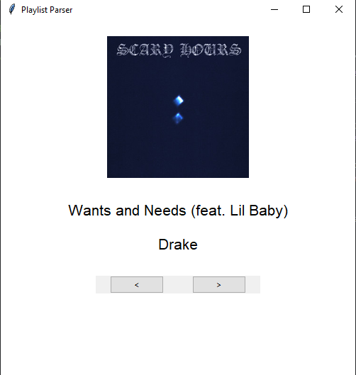

# Spotify Playlist Parser

An intuitive GUI tool for quickly and efficiently parsing Spotify playlists. 
This tool is built on the [SpotAPI library](https://github.com/Aran404/SpotAPI) and is designed to be user-friendly, making it easy to manage and edit your Spotify playlists.

## Features
- **User-Friendly Interface**: Simple and effective GUI for playlist management.
- **Fast Parsing**: Efficiently handle large playlists with ease.
- **Built with SpotAPI**: Leverages the powerful SpotAPI library for Spotify integration.

## Requirements
To use this tool, you will need a CapSolver API key for initial login. Alternatively, you can manually provide cookies for authentication.

- Obtain a CapSolver API key from [CapSolver](https://capsolver.com/).

## Installation
Follow these steps to install and run the application:

1. **Install Dependencies**:
    ```bash
    pip install -r requirements.txt
    ```

2. **Run the Application**:
    ```bash
    python main.py
    ```

## Usage
1. **Initial Setup**:
   - Edit the config.json with your information.
   - Enter which playlist you'd like to process.
   - Either press the right arrow button or use > on your keyboard to keep a song.
   - Either press the left arrow button or use < on your keyboard to discard a song.

## Screenshot


## Contributing
Contributions are welcome! If you find any issues or have suggestions, please open an issue or submit a pull request.

## License
This project is licensed under the **GPL 3.0** License. See [LICENSE](https://choosealicense.com/licenses/gpl-3.0/) for details.

## Acknowledgments
- [SpotAPI](https://github.com/Aran404/SpotAPI) for providing the core functionality.
